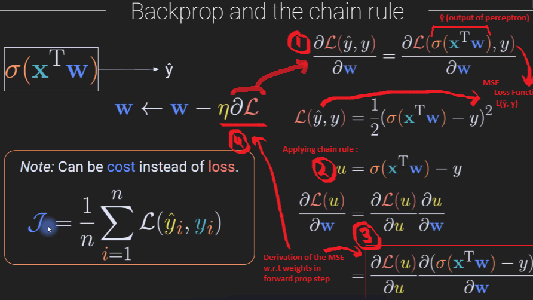
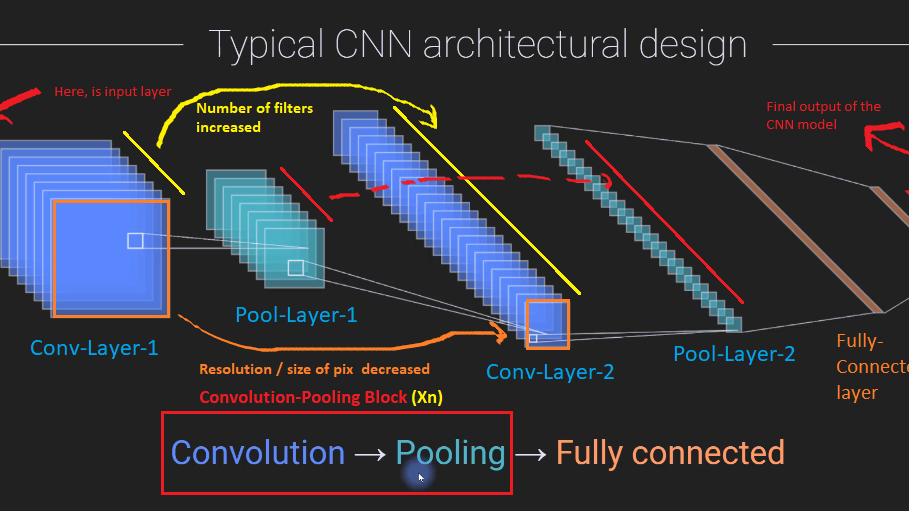

<div style="display: flex; justify-content: space-around; align-items: center;">
  
  
<!--    -->
<!--    -->
</div>

## 📜 complete-deep-learning
#### 🧠 Overview 
Complete Deep Learning concepts &amp; Architectures implemented using PyTorch. This is a comprehensive Deep Learning roadmap and implementation using PyTorch — starting from core math foundations to state-of-the-art neural network architectures. The repository is designed to give a solid theoretical and practical understanding of deep learning, structured progressively to cover foundational concepts, mathematical intuition, model architectures, training, and evaluation.

#### 🎯 Use Cases 
- Implementing DL algorithms/models/concepts using python & pytorch
- Learning & implementing the mathematical foundation of deep learning using python & pytorch
- Learn deep learning from scratch with a mathematical + implementation-first approach
- Study & build neural networks with PyTorch
- Study & build DL architectures with PyTorch
- Prepare for interviews and research
- Use as a practical teaching/learning guide
- Reference architecture and code for deep learning projects
  
#### 🟢 Project Status
- Current Version: V1.0
- Actively maintained & expanded

#### 📂 Repository Structure
```
complete-deep-learning
├── images
│
├── datasets
│   └── images-text-audio-misc
│
├── math-foundations
│   ├── linear-algebra
│   ├── calculus
│   └── probability-stats
│                                              
├── basic-neural-network-architecture
│   ├── neuron-perceptron
│   ├── neural-net-layers
│   │   ├── input-hidden-output-layers
│   ├── activation-functions
│   ├── ann (multilayer-perceptron)
│   │   ├── geometric-view
│   │   ├── ann-maths (forwardprop, error-los-cost, backrprop)
│   │   ├── ann-regression-clasification
│   │   ├── multi-layer-ann
│   │   ├── multi-output-ann
│   │   └── model-depth-breadth
│   ├── meta-parameters
│   └── hyper-parameters
│
├── neural-network-concepts
│   ├── regularization
│   │   ├── prevent-overfitting-underfitting
│   │   ├── weight-reg
│   │   ├── dropout
│   │   ├── data-augmentation
│   │   ├── nomralization
│   │   │   ├── batch-nomralization
│   │   │   └── layer-nomralization
│   │   └── early-stopping
│   ├── optimization
│   │   ├── loss-cost-functions
│   │   ├── gradient-descent
│   │   |   ├── vanilla-gd, sgd, minibatch-sgd
│   │   ├── adaptive-optimization-algorithms
│   │   |   ├── momentum, nag, adagrad, rmsprop, adam, adamw
│   │   ├── learning-schedules
│   │   ├── weight-investigations
│   │   ├── numerical-stability
│   │   ├── meta-parameter-optimization
│   │   └── hyper-parameter-optimization
│   └── generalization
│       ├── cross-validation
│       ├── overfitting-underfitting
│       └── hyper-parameter-tuning
│
├── computational-performance
│   └── run-on-gpu
│
├── advanced-neural-network-architecture
│   ├── ffn
│   ├── cnn-modern-cnn
│   │   ├── convolution
│   │   ├── cannonical-cnn
│   │   └── cnn-adv-architectures
│   ├── rnn
│   │   ├── lstm
│   │   ├── gru
│   ├── gan
│   ├── gnn
│   ├── attention-mechanism
│   ├── transformer-models
│   │   └── bert
│   └── encoders
│       └── autoencoders
│
├── model-training
│   ├── transfer-learning
│   ├── style-transfer
|   ├── training-loop-structure (epoch, batch, loss logging)
|   ├── callbacks (custom logging, checkpointing)
|   ├── experiment-tracking (Weights & Biases, TensorBoard)
│   └──  multitask-learning
│
└── model-evaluation
|   ├── accuracy-precision-recall-f1-auc-roc
|   └── confusion-matrix
│
└── papers-to-code
```

### ✨ Features
- Covers Concepts, Mathematical implementations, DL nets and architectures
- Pure Python and Pytorch
- Modular, clean, and reusable code
- Educational and beginner-friendly
- Covers everything from perceptrons to transformers
- Clean, modular, and well-commented PyTorch implementations
- Visualization, training loops, and performance metrics
- Includes datasets for images, text, audio, and more
- Papers-to-Code section to implement SOTA research

<!-- ### 🔍 Demo
<a href="https://youtu.be/Qor8kjsCJkA?si=7d1Mhc0KW4GQb3sF" target="_blank">
  
</a> -->

### 🚀 Getting Started
- Knowledge Required : python, linear algebra, probability, statistics, numpy, matplotlib, scikit-learn, pytorch

<!-- ### 🛠️ Hardware Requirements
- None
-->

#### 💻 Software Requirements
- IDE (VS Code) or jupyter notebook or google colab
- Python 3
  
#### 🛡️ Tech Stack
- Python , PyTorch, TorchVision 💻
- Numpy, Pandas, Matplotlib, Scikit-Learn 🧩

<!--
### 🖇️ Schematic
- none
-->

#### ⚙️ Installation
```
git clone https://github.com/pointer2Alvee/complete-deep-learning.git
cd comprehensive-deep-learning
```

#### 📖 Usage
- Open .ipynb files inside each concept or NN architecture directory and
- Run them to see training/inference steps, plots, and results.

#### 🔍 Contents Breakdown
##### 📚 Math Foundations
- Linear Algebra, Calculus, Probability, Statistics

##### 🧱 Neural Network Basics
- Perceptrons, Layers, Activations, MLPs
- Forward & Backpropagation math from scratch
- Depth vs Breadth of models
- Regression & Classification using ANN

##### 🔧 Deep Learning Concepts
- Regularization (Dropout, L2, Data Aug)
- Optimization (SGD, Adam, RMSProp, Schedules)
- Losses, Weight tuning, Meta & Hyperparams

##### ⚙️ Advanced Architectures
- CNNs (classic + modern)
- RNNs, LSTM, GRU
- GANs, GNNs
- Transformers & BERT
- Autoencoders

##### 🏋️‍♂️ Model Training & Tracking
- Training Loops, Epochs, Batches
- Custom callbacks
- TensorBoard, Weights & Biases logging
- Transfer Learning & Style Transfer
- Multitask learning

##### 📊 Evaluation
- Accuracy, Precision, Recall, F1, AUC-ROC
- Confusion Matrix

##### 🔬 Research to Practice
- Paper Implementations → PyTorch Code


### 🧪 Sample Topics Implemented
- ✅ Forward & Backpropagation from scratch
- ✅ CNN with PyTorch
- ✅ Regularization (Dropout, Weight Decay)
- ✅ Adam vs SGD Performance Comparison
- ✅ Image Classification using Transfer Learning
- ✅ Transformer Attention Visualizations
- ✅ Autoencoder for Denoising
- ✅ Style Transfer with Pretrained CNN
  
- ⏳ Upcoming  : nlp, cv, llm, data engineering, feature engineering

### 🧭 Roadmap
- [x] Build foundational math notebooks
- [ ] Implement perceptron → MLP → CNN
- [ ] Add reinforcement learning section
- [ ] Implement GAN, RNN, Transformer
- [ ] More research paper implementations

### 🤝 Contributing
Contributions are welcomed!
1. Fork the repo. 
2. Create a branch: ```git checkout -b feature/YourFeature```
3. Commit changes: ```git commit -m 'Add some feature'```
4. Push to branch: ```git push origin feature/YourFeature```
5. Open a Pull Request.

### 📜License
Distributed under the MIT License. See LICENSE.txt for more information.

### 🙏Acknowledgements
- Special thanks to the open-source community / youtube for tools and resources.
